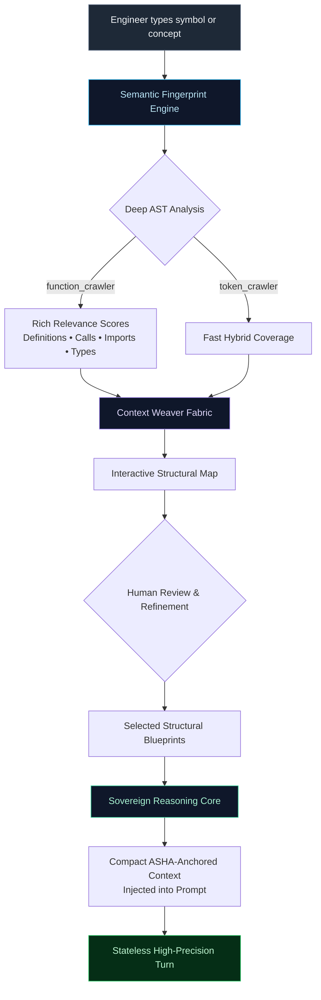

# NEXUS WEAVER
## Fingerprint-Driven Context Priming

**The Intelligent Context Fabric for Sovereign AI Coding**

> **“The model stays stateless. Intent stays human. Code state stays cryptographically precise.”**  
> Now an engineer can **summon exactly the right structural intelligence** with a single token — and the system understands *why* it matters.

---

## The Invisible Crisis in AI-Assisted Development

Most AI coding tools still operate with a broken mental model of context:

- **Starvation mode**: The model hallucinates APIs and invents patterns because it lacks precise structural awareness.
- **Flood mode**: Entire files are dumped in, attention fractures, token costs explode, and the model becomes lazy and imprecise.
- **Brittle mode**: Reliance on fragile line numbers and naive diffs that shatter the moment code is refactored.
- **Manual tax**: The engineer is forced to act as a full-time context curator on every single turn.

The result is predictable: long-running, high-precision sessions become exhausting. The model loses the plot. The engineer becomes a prompt janitor instead of an architect.

**Atomic Threadder already solved the hardest problems**:
- True stateless reasoning turns
- Human-vetted sidecar summarization for continuity and intent
- **ASHA** — the cryptographic, AST-bound, content-addressed foundation for code topology

What remained was the critical missing link: **an intelligent, low-friction way to select precisely the right structural blueprints** the reasoning engine should see on any given turn.

**Nexus Weaver** is that link.

---

## Nexus Weaver — Cryptographic Context at the Speed of Thought

**Nexus Weaver** is the Intelligent Context Fabric.

It appears as a native, first-class surface in the workspace and gives the engineer god-like leverage over context:

1. **See the entire workspace topology** as a living, interactive structural map
2. **Type any symbol or concept** — the **Semantic Fingerprint Engine** instantly surfaces every relevant structural node using deep AST analysis
3. **Review and refine** with rich, explainable relevance signals
4. **Weave** those compact, cryptographically anchored structural blueprints directly into the next reasoning turn — surgically, transparently, and under full human control

The reasoning engine receives a tiny, high-signal structural map instead of noise.  
The engineer stays in complete command.  
**ASHA guarantees precision.**

This is not RAG.  
This is not “attach files.”  
**This is cryptographic context fingerprinting at the speed of thought.**

---

## The Experience — When Context Finally Feels Intelligent

Imagine you are deep in a complex refactoring involving drift analysis and state transitions.

You simply type into the Smart Prime field:

```
drift timeline coordination
```

**Instantly** the system responds with surgical intelligence:

- The core drift coordination hook lights up with **maximum relevance** (definition + multiple type references)
- The cryptographic drift analysis engine appears with heavy call-site density
- The structural directive parser and prompt composition layer are automatically included
- Supporting UI orchestration surfaces are highlighted with clear explanations

Beautiful relevance badges appear. A clean **Context Health** panel (designed with the same visual language as the live system awareness layer) shows exactly *why* each structural node was selected. You glance, optionally deselect one low-signal utility, and tap **Weave into Next Turn**.

The next message sent to the reasoning engine now contains a pristine, labeled block of structural intelligence — compact signatures, ASHA anchors, and nothing else.

The model responds with **surgically accurate** proposals that reference the exact cryptographic handles. Later, the Cryptographic Drift Engine can validate and apply those changes with character-perfect fidelity.

No full source files.  
No hallucinated structure.  
No context debt.  
Just pure, high-bandwidth signal.

---

## Architecture — The Sovereign Context Fabric



### The Layered Power System

| Layer                        | Responsibility                              | Why It Creates Unfair Advantage                          |
|-----------------------------|---------------------------------------------|----------------------------------------------------------|
| **Semantic Fingerprint Engine** | Deep AST usage intelligence + relevance scoring | Understands *why* a structural node matters, not just that it exists |
| **Cryptographic Topology Layer (ASHA)** | Content-addressed blocks + immutable handles | Reasoning happens against stable cryptographic anchors instead of fragile text |
| **Context Weaver Fabric**   | Human-governed state + selection orchestration | Engineer stays in control while automation does the heavy lifting |
| **Sovereign Reasoning Core** | Prompt composition + dispatch               | Only high-signal, explicitly chosen structural context ever reaches the model |
| **Live Awareness Surface**  | Unified diagnostics + issue intelligence    | Context health, priming events, and drift risk appear natively alongside system awareness |

---

## Deep Synergy with the Existing Sovereign Architecture

Nexus Weaver does not bolt onto the system — it **emerges** from it.

- It lives inside the same native workspace surface as the live system awareness layer, inheriting its visual language, event model, and interaction patterns.
- It is powered by the same **Semantic Fingerprint Engine** (deep AST crawlers) already present in the codebase.
- It feeds directly into the **Sovereign Reasoning Core**, preserving the stateless turn contract and sidecar summarization for intent.
- Every selection is ultimately grounded in the **Cryptographic Topology Layer (ASHA)**, so proposed changes can be validated and applied by the drift engine with zero ambiguity.

The result is a coherent, unified intelligence surface instead of fragmented tools.

---

## The Core Innovations

**1. Relevance as a First-Class Primitive**  
The Semantic Fingerprint Engine doesn’t just find matches — it understands semantic weight (definitions > calls > imports > references) and surfaces that understanding visually and algorithmically.

**2. Skeleton-Only Structural Intelligence**  
Never full source. Only compact, cryptographically annotated public surfaces. The reasoning engine receives exactly what it needs to reason precisely — nothing more.

**3. Human-Governed Auto-Magic**  
The engine proposes with explainable confidence. The interactive map shows why. The engineer confirms or refines in seconds. No black box. No loss of agency.

**4. Cryptographic Continuity**  
Because every structural blueprint carries its ASHA handle, any edit the model proposes can later be validated and applied by the drift engine with surgical precision.

**5. Zero Context Debt**  
Each turn begins clean. The only persistent context is what the engineer deliberately wove in — plus the human-refined sidecar summary. No accumulated rot.

---

## The Impact — Why This Changes the Game

- **Dramatic token efficiency** — 10–20× reduction in noise compared with file dumping or naive retrieval.
- **Step-change in reasoning precision** — The model operates against real structural fingerprints instead of guessed context.
- **Flow-state engineering** — Context selection transforms from tedious ritual into “type concept → done.”
- **Full auditability and trust** — Every primed context is logged, explainable, and cryptographically anchored.
- **Future-proof extensibility** — The same fabric can power smart hydration, sprint scoping, automated drift previews, and more.

This is what serious, long-horizon, high-precision AI collaboration was always meant to feel like.

---

## The Road Ahead

Nexus Weaver is designed for continuous evolution:

- Named context presets that capture recurring high-signal structural sets
- Background symbol indexing for instantaneous priming
- Visual call-graph overlays for primed structural neighborhoods
- One-click priming directly from code selections or search results
- Closed-loop integration with the Cryptographic Drift Engine for “prime → propose → preview drift → apply”

---

## Closing — The New Standard

**Nexus Weaver** takes three already exceptional subsystems — the Cryptographic Topology Layer, the Semantic Fingerprint Engine, and the Human-Governed Stateless Turn model — and fuses them into something greater than the sum of their parts.

It creates a living, intelligent, cryptographically grounded **Context Fabric** that lets an engineer think at the level of symbols, intent, and structure — while the system handles topology, relevance, and precision.

No other environment currently offers this combination of cryptographic anchoring, deep AST semantic understanding, human governance, and native integration into a coherent workspace.

**This is the feature that makes sovereign AI coding sessions feel inevitable.**

---

**Nexus Weaver — Fingerprint-Driven Context Priming**  
*Where cryptographic precision meets human intent at the speed of thought.*

**Status**: Vision + Technical Specification v2.0  
**Companion**: Full sequential implementation playbook available

*Built on the foundation you already created.*  
*Now the foundation can finally see exactly where to apply its strength.*